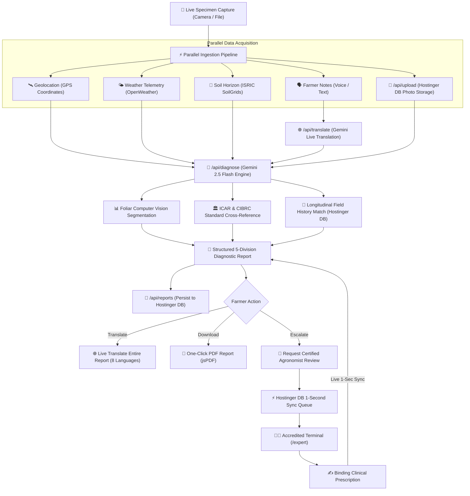

# 🌱 CULTIO — AI-Powered Agricultural Diagnostics & Decision-Support Platform

<div align="center">


**Real-time AI foliar diagnostics, microclimate soil telemetry, Hostinger server & DB photo storage, live multilingual translation, dual-tab role authentication, certified human agronomist escalation, and publication-grade PDF reporting.**

[Live Production Web App](https://cultio.wwislib.com) • [Quick Evaluator Login](#-sample-expert-login-details-for-evaluators) • [Hostinger DB & Storage](#-hostinger-database--photo-storage-architecture) • [Architecture Guide](#-system-architecture--workflow)

</div>

---

## 📖 Executive Summary

**Cultio** is an enterprise-grade agricultural intelligence platform built for smallholders, commercial growers, and certified agronomists. It addresses the critical disconnect between laboratory-grade computer vision models and practical field execution in rural conditions.

By fusing **multimodal visual diagnostic AI (Google Gemini 2.5 Flash)** with **live hyper-local microclimate weather**, **ISRIC SoilGrids edaphic profiles**, **dedicated Hostinger server database & photo storage**, **Phone.Email mobile OTP verification**, and **official government advisory registries (ICAR & CIBRC)**, Cultio delivers decisive, actionable, and legally compliant crop protection guidance in under three seconds.

---

## 🔑 Sample Expert Login Details for Evaluators

For hackathon judges and evaluators reviewing the **Agricultural Expert Terminal (`/expert`)**, pre-configured demo credentials are provided right in the signup/signin modal:

| Field | Sample Evaluator Credential |
|---|---|
| **Role Tab** | **🔬 Agricultural Expert** (Second Tab) |
| **Email** | `expert@cultivo.ai` |
| **Password** | `password123` |
| **Accreditation Passkey** | `ICAR-EXP-2026` |
| **Specialization** | Plant Pathology & Crop Health |
| **Institution** | Indian Council of Agricultural Research (ICAR) |

> ⚡ **1-Click Instant Login**: Open the Sign In modal, click the **"🔬 Agricultural Expert"** tab, and tap the green **"⚡ Instant Sign In as Expert"** button to immediately enter the accredited agronomist terminal without typing!

---

## 🏛️ Core Architectural Principle

> **"No prestored dummy data — pure live analysis. Previous analysis data is persisted to compute longitudinal field trajectories and actionable recurrence alerts."**

1. **Pure Live Ingestion**: Cultio never serves pre-cached or synthetic demo reports. All diagnostics compute strictly in real-time from a live device camera specimen capture or user photo upload combined with live environmental telemetry.
2. **Longitudinal History & Trend Intelligence**: Every completed scan is stored in the cultivator's persistent field record in the **Hostinger Database**. Subsequent scans automatically compute longitudinal metrics:
   - **Severity Trajectory**: Evaluates whether infection is *improving*, *deteriorating*, or *stable* relative to prior scans in the sector.
   - **Pathogen Recurrence Warnings**: Flags persistent soil-borne or airborne reinfections (e.g. *Alternaria solani*, *Phytophthora infestans*).
   - **Treatment Continuity Guidance**: Adjusts fungicide or organic spray recommendations based on previously applied modes of action to prevent fungal resistance.

---

## 🗄️ Hostinger Database & Photo Storage Architecture

Cultio runs on a dedicated Hostinger production environment (`cultio.wwislib.com`) with **zero reliance on Firebase Storage** for photos.

### 1. Photo Storage on Hostinger Server
- **No Third-Party Cloud Buckets**: Specimen photographs are never sent to Firebase Storage. All photos are directly uploaded to Hostinger server storage via `/api/upload`.
- **High-Performance Image Streaming**: Images are streamed directly with immutable cache-control headers through `/uploads/[filename]`, providing instant, low-latency image previews in rural bandwidth conditions.
- **Offscreen Compression**: Before transmission, foliar images are resized and compressed on an offscreen HTML5 canvas to ~200-400KB, reducing upload times over 2G/3G rural networks.

### 2. Hostinger Persistent Database (`src/lib/hostingerDb.ts`)
- **Photos Collection**: Indexes every uploaded specimen with unique photo IDs, file names, download paths, user IDs, sizes, and timestamps.
- **Reports Collection**: Stores complete field diagnostics, AI analyses, GPS coordinates, weather conditions, soil data, and agronomist reviews.
- **Server Persistence**: Atomic write-locking engine persists state safely on the Hostinger server disk (`data/hostinger_db.json`), surviving server reboots without database corruption.

### 3. Continuous 1-Second Telemetry Sync
- **Real-Time Heartbeat**: The frontend establishes a high-frequency 1-second continuous telemetry sync with Hostinger DB (`/api/reports`).
- **Instant Escalation & Prescriptions**: When an agronomist reviews a case or a farmer scans a crop, updates reflect across all connected terminals within 1 second.

---

## 🌟 Key Features & Capabilities

### 1. 👥 Two-Tab Role Isolation & Authentication
- **Tab 1: 🌱 Farmer / Cultivator (Normal Person)**:
  - Instant mobile OTP login via **Phone.Email** (SMS & WhatsApp 1-tap verification).
  - Google One-Tap sign-in.
  - Standard email/password registration.
  - Streamlined, friendly UI designed specifically for rural cultivators.
- **Tab 2: 🔬 Agricultural Expert (Certified Agronomist)**:
  - Dedicated institutional login and registration.
  - Displays sample evaluator login credentials directly on the card with 1-click autofill.
  - Collects agronomic specialization, license numbers, and research station affiliations.
- **Strict Role Gatekeeping (No Farmer Role Elevation in Web)**:
  - Once authenticated as a **Field Cultivator**, **all role-switching options, passkey elevation inputs, and expert review buttons are strictly locked out**.
  - Farmers cannot switch to expert or view agronomist terminals while logged in as a cultivator.
  - If a logged-in farmer visits `/expert`, an explicit access restriction screen is presented with a **"Sign Out to Switch Account"** option.

### 2. 🌐 Live Dynamic Web & Report Translator
- **Translate Everything on Demand**: When a user selects a language or taps the **"Translate Report Live"** button, the platform live-translates the entire report in real-time via Google Gemini.
- **Full Report Content Translation**:
  - Matched crop & botanical species names
  - Primary diagnosed condition & severity
  - Biological etiology & root-cause narrative
  - Visual symptom observations
  - Ordered action plan steps (immediate containment, eradication, recovery)
  - Organic remedies and dosages
  - CIBRC-approved chemical formulations with active ingredients and Pre-Harvest Intervals (PHI)
  - Official ICAR government advisories
  - Certified agronomist clinical prescriptions
- **Bilingual & Instant View Toggle**: Seamlessly toggle between "View Original (English)" and "Live Translated ([Language])".
- **Translated PDF Export**: When downloading the official PDF report while viewing in a translated language, the exported publication-grade PDF is generated in the translated language.
- **8 Supported Languages**:
  - English (`en`)
  - Hindi (`hi` — हिन्दी)
  - Telugu (`te` — తెలుగు)
  - Tamil (`ta` — தமிழ்)
  - Kannada (`kn` — ಕನ್ನಡ)
  - Marathi (`mr` — मराठी)
  - Bengali (`bn` — বাংলা)
  - Spanish (`es` — Español)

### 3. 🔬 Decisive Multimodal AI Diagnostics
- **Gemini 2.5 Flash Engine**: Leverages Google's latest multimodal vision architecture via the official `@google/genai` SDK with intelligent cascade fallbacks for sub-second foliar feature extraction.
- **Decisive Crop Identification**: Accurately classifies crop species across major staples and cash crops: Tomato, Potato, Chilli, Maize, Rice, Wheat, Cotton, Sugarcane, Citrus, and Pulses without hardcoded generic responses.
- **Analytical Confidence & Explanations**: Eliminates unhelpful "low confidence" cop-outs. The model provides an analytical confidence rating (High, Moderate, Low) along with an explicit botanical explanation detailing visible morphological signs.
- **Differential Diagnoses**: Evaluates alternative candidate pathologies to assist human agronomists during clinical escalation.
- **Root-Cause Environmental Correlation**: Cross-references ambient relative humidity, soil pH, and recent rainfall to determine whether microclimate conditions catalyzed the pathogen outbreak.

### 4. 🌿 Computer Vision Foliar Metrics & Lesion Analytics
- **Lesion Surface Area Estimation**: Quantifies percentage of necrotic foliage vs. healthy canopy.
- **Chlorophyll Health Index (NDVI-Approximation)**: Measures photosynthetic vitality on a -1.0 to +1.0 scale.
- **Color Distribution Breakdown**: Categorizes foliage pixels into Healthy Green, Chlorotic Yellow, and Necrotic Brown.
- **Lesion Cluster Counter**: Detects discrete pathogen infection foci across the leaf blade.

### 5. 🏛️ Official Government Guidelines (ICAR & CIBRC Integration)
- **Verified Research Backing**: Cross-references every diagnosis with official packages of practices from the **Indian Council of Agricultural Research (ICAR)**.
- **Regulated Chemistry & CIBRC Formulations**: Displays legally approved chemical active ingredients (e.g., Mancozeb 75% WP, Chlorothalonil 75% WP, Azoxystrobin 23% SC) with precise water dilution ratios.
- **Pre-Harvest Intervals (PHI)**: Enforces mandatory harvest safety waiting periods (in days) to prevent toxic chemical residues in market produce.
- **Direct Portal Links**: Deep links to verified portals including [Kisan Suvidha (Government of India)](https://kisansuvidha.gov.in).

### 6. 📱 Phone.Email Instant Mobile OTP Sign In
- Integrated with the **Phone.Email** lightweight instant sign-in button using Client ID `13311688567845248231`.
- Authenticates users via real SMS or WhatsApp OTP without requiring passwords or complex email verification steps.
- Backend verified through `/api/auth/phone-verify` route for production security.

### 7. 🔒 Accredited Agronomist Portal (`/expert`)
- **Protected Terminal Gate**: Only approved institutional IDs (`@icar.gov.in`, `@gov.in`, `expert@cultivo.ai`) or valid passkeys (`ICAR-EXP-2026`) can unlock the terminal.
- **Live Incoming Case Queue**: Real-time Hostinger DB synchronization of escalated field cases awaiting clinical review.
- **Structured Agronomist Prescriptions**: Certified agronomists issue binding clinical prescriptions that automatically pin **above** AI recommendations on the farmer's device.

### 8. 📄 Publication-Grade PDF Report Export
- **One-Click Instant Download**: Generates high-resolution, vector-crisp PDF reports directly in the browser via `jsPDF`.
- **Comprehensive Document Layout**:
  - Official Cultio Forest Green header & status badge
  - Specimen image, GPS telemetry, operator identity, and timestamp
  - Diagnostic breakdown with confidence rating and differential conditions
  - Microclimate and edaphic telemetry tables (temperature, humidity, soil pH, organic matter)
  - Computer vision foliar metrics (lesion %, chlorophyll index, color breakdown)
  - Pathogen etiology and environmental root cause narrative
  - Official ICAR / CIBRC government advisory standards
  - Chronological integrated action plan (ordered steps, organic controls, regulated chemicals with PHI)
  - Longitudinal field history and recurrence trend alerts
  - Certified agronomist clinical endorsement (if reviewed)
  - Digital verification hash and official compliance footer

---

## 🎨 Earthical Agritech Design System

Cultio is designed with an **Earthical Palette** engineered for high-contrast sunlight readability in dusty outdoor field conditions:

| Token | Hex Code | Visual Application |
|---|---|---|
| `earth-bg` | `#F9F6F0` | Warm natural cream background |
| `earth-surface` | `#FFFFFF` | Crisp white elevated component cards |
| `earth-primary` | `#2E7D32` | Vibrant forest crop green (primary actions) |
| `earth-text` | `#4E342E` | Deep rich soil brown (high-contrast typography) |
| `earth-accent-sun`| `#F57C00` | Harvest amber (expert badges & alerts) |
| `earth-accent-leaf`| `#81C784` | Sprout green (healthy indicators & chips) |
| `earth-danger` | `#D32F2F` | Critical severity & fungal alerts |
| `earth-warning`| `#FFA000` | Moderate severity & cautionary notes |
| `earth-border` | `#E0D7C6` | Sandstone card borders & dividers |

---

## 🏗️ System Architecture & Workflow



---

## 📁 Repository Structure

```
Cultio/
├── data/                       # Hostinger persistent database directory
│   ├── .gitkeep
│   └── hostinger_db.json       # Persistent photos and reports store
├── public/                     # Static assets, logos, and uploaded files
│   ├── uploads/                # Hostinger server photo storage
│   ├── logo.png                # Cultio corporate emblem
│   └── favicon.ico
├── src/
│   ├── app/
│   │   ├── api/
│   │   │   ├── auth/
│   │   │   │   └── phone-verify/ # Phone.Email backend verification
│   │   │   ├── diagnose/       # Gemini 2.5 Flash multimodal diagnostic endpoint
│   │   │   ├── reports/        # Hostinger DB reports CRUD & sync endpoint
│   │   │   ├── translate/      # Real-time full report & text translation endpoint
│   │   │   └── upload/         # Hostinger server & DB photo upload API
│   │   ├── expert/             # Dedicated Accredited Agronomist Portal page
│   │   ├── uploads/[filename]/ # Fast streaming image route with caching
│   │   ├── globals.css         # Tailwind v4 theme tokens & Earthical variables
│   │   ├── layout.tsx          # Root HTML metadata & font definitions
│   │   └── page.tsx            # Main application router (Landing / Diagnostic / Camera)
│   ├── components/
│   │   ├── auth/
│   │   │   ├── AuthModal.tsx          # Dual-tab Farmer & Expert authentication modal
│   │   │   ├── PhoneEmailButton.tsx   # Phone.Email instant mobile OTP button
│   │   │   ├── PrivacyConsentModal.tsx # Hardware permissions & Hostinger DB policy
│   │   │   ├── RoleModal.tsx          # Workspace setup & passkey gateway
│   │   │   └── UserProfileModal.tsx   # User profile modal (strictly isolated for farmers)
│   │   ├── camera/
│   │   │   ├── CameraWorkflow.tsx     # Hardware capture, translation & voice dictation
│   │   │   └── DiagnosticProgress.tsx # Real-time transparent pipeline status
│   │   ├── expert/
│   │   │   ├── ExpertDashboard.tsx    # Agronomist queue & review terminal
│   │   │   └── ExpertReviewModal.tsx  # Structured clinical prescription modal
│   │   ├── layout/
│   │   │   ├── LanguageSelector.tsx   # 8-language in-app dropdown
│   │   │   ├── MobileBottomNav.tsx    # Responsive bottom navigation (farmer-isolated)
│   │   │   └── Navbar.tsx             # Responsive header with Hostinger DB badge
│   │   ├── report/
│   │   │   ├── DivisionIdentity.tsx       # Division 1: Crop identity & status
│   │   │   ├── DivisionEnvironment.tsx    # Division 2: Soil & weather tables
│   │   │   ├── DivisionDiagnosis.tsx      # Division 3: AI diagnosis & ICAR links
│   │   │   ├── DivisionActionPlan.tsx     # Division 4: IPM treatments with PHI
│   │   │   ├── DivisionEscalation.tsx     # Division 5: Human expert escalation
│   │   │   ├── DivisionComputerVision.tsx # Lesion area % & canopy density
│   │   │   ├── DivisionHistoryInsights.tsx# Longitudinal trend comparisons
│   │   │   ├── ExpertNoteCard.tsx         # Pinned human agronomist review
│   │   │   └── ReportView.tsx             # Live report viewer, translator & PDF download
│   │   └── ui/                            # Atomic design buttons, cards, badges
│   ├── config/
│   │   ├── experts.ts          # Approved agronomist whitelist & passkey validator
│   │   └── firebase.ts         # Firebase Auth configuration (Storage removed)
│   ├── context/
│   │   ├── AuthContext.tsx     # Session management & expert accreditation logic
│   │   └── LanguageContext.tsx # 8-language in-app dictionary & live report translation
│   ├── lib/
│   │   └── hostingerDb.ts      # Hostinger persistent database engine (Photos & Reports)
│   ├── services/
│   │   ├── recommendations.ts  # ICAR/CIBRC rule engine & action plans
│   │   ├── reportExport.ts     # Publication-grade vector PDF generator (jsPDF)
│   │   ├── reports.ts          # Hostinger DB API sync & 1-sec real-time telemetry
│   │   ├── soil.ts             # ISRIC SoilGrids client & edaphic parser
│   │   ├── storage.ts          # Hostinger server & DB photo storage service
│   │   └── weather.ts          # OpenWeather Agro client
│   └── types/
│       └── index.ts            # Central TypeScript domain interfaces
├── package.json                # Project dependencies & build scripts
└── README.md                   # Complete architectural documentation
```

---

## 🚀 Getting Started

### Prerequisites
- Node.js 20.x or 22.x
- npm 10.x or higher

### 1. Clone & Install

```bash
git clone https://github.com/soumith-64/Cultio.git
cd Cultio
npm install
```

### 2. Configure Environment Variables

Create a `.env.local` file in the project root:

```bash
cp .env.local.example .env.local
```

Populate the keys with your credentials:

```env
# Google Gemini Generative AI (Server-Side)
GEMINI_API_KEY=your_gemini_api_key_here

# OpenWeather API (Server-Side)
OPENWEATHER_API_KEY=your_openweather_api_key_here

# Optional: ISRIC SoilGrids REST Integration (defaults to intelligent local fallback)
NEXT_PUBLIC_USE_ISRIC=false

# Firebase Auth Configuration (Photos & reports are stored directly on Hostinger DB)
NEXT_PUBLIC_FIREBASE_API_KEY=your_firebase_api_key
NEXT_PUBLIC_FIREBASE_AUTH_DOMAIN=your_project.firebaseapp.com
NEXT_PUBLIC_FIREBASE_PROJECT_ID=your_project_id
NEXT_PUBLIC_FIREBASE_MESSAGING_SENDER_ID=your_sender_id
NEXT_PUBLIC_FIREBASE_APP_ID=your_app_id
```

> **Zero-Config Hostinger DB Storage**: Photos and diagnostic reports are persisted automatically in `data/hostinger_db.json` and `public/uploads` on your Hostinger server with zero third-party storage fees!

### 3. Run Development Server

```bash
npm run dev
```

Open [http://localhost:3000](http://localhost:3000) in your browser.

### 4. Build for Production

```bash
npm run build
npm start
```

---

## 📜 License

Distributed under the **MIT License**. See `LICENSE` for details.

---

<div align="center">

**Developed with ❤️ for Farmers, Agronomists, and Agricultural Extension Workers Worldwide.**

</div>
