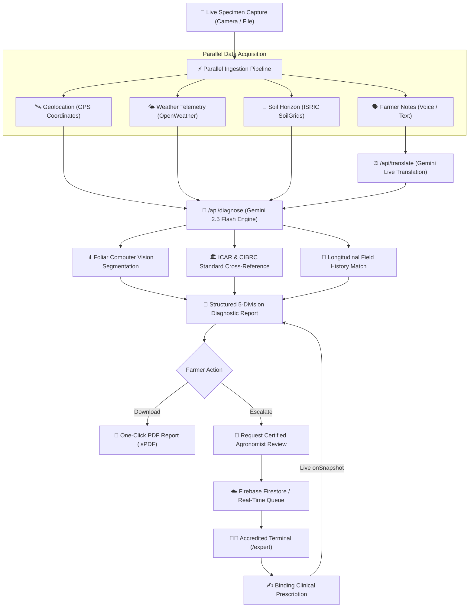

# 🌱 CULTIO — AI-Powered Agricultural Diagnostics & Decision-Support Platform

<div align="center">


**Real-time AI foliar diagnostics, microclimate soil telemetry, live translation, certified human agronomist escalation, and publication-grade PDF reporting.**

[Live Production Web App](https://cultio.wwislib.com) • [Report a Vulnerability](#-security--privacy) • [Accreditation Guide](#-approved-expert-registry--evaluator-credentials)

</div>

---

## 📖 Executive Summary

**Cultio** is an enterprise-grade agricultural intelligence platform built for smallholders, commercial growers, and certified agronomists. It addresses the critical disconnect between laboratory-grade computer vision models and practical field execution in rural conditions.

By fusing **multimodal visual diagnostic AI (Google Gemini 2.5 Flash)** with **live hyper-local microclimate weather**, **ISRIC SoilGrids edaphic profiles**, and **official government advisory registries (ICAR & CIBRC)**, Cultio delivers decisive, actionable, and legally compliant crop protection guidance in under three seconds.

---

## 🏛️ Core Architectural Principle

> **"No prestored dummy data — pure live analysis. Previous analysis data is persisted to compute longitudinal field trajectories and actionable recurrence alerts."**

1. **Pure Live Ingestion**: Cultio never serves pre-cached or synthetic demo reports. All diagnostics compute strictly in real-time from a live device camera specimen capture or user photo upload combined with live environmental telemetry.
2. **Longitudinal History & Trend Intelligence**: Every completed scan is stored in the cultivator's persistent field record. Subsequent scans automatically compute longitudinal metrics:
   - **Severity Trajectory**: Evaluates whether infection is *improving*, *deteriorating*, or *stable* relative to prior scans in the sector.
   - **Pathogen Recurrence Warnings**: Flags persistent soil-borne or airborne reinfections (e.g. *Alternaria solani*, *Phytophthora infestans*).
   - **Treatment Continuity Guidance**: Adjusts fungicide or organic spray recommendations based on previously applied modes of action to prevent fungal resistance.

---

## 🌟 Key Features & Capabilities

### 1. 🔬 Decisive Multimodal AI Diagnostics
- **Gemini 2.5 Flash Engine**: Leverages Google's latest multimodal vision architecture via the official `@google/genai` SDK for sub-second foliar feature extraction.
- **Decisive Crop Identification**: Accurately classifies crop species across major staples and cash crops: Tomato, Potato, Chilli, Maize, Rice, Wheat, Cotton, Sugarcane, Citrus, and Pulses.
- **Analytical Confidence & Explanations**: Eliminates unhelpful "low confidence" cop-outs. The model provides an analytical confidence rating (High, Moderate, Low) along with an explicit botanical explanation detailing visible morphological signs (e.g. concentric target-like rings, chlorotic halos, interveinal necrosis).
- **Differential Diagnoses**: Evaluates alternative candidate pathologies to assist human agronomists during clinical escalation.
- **Root-Cause Environmental Correlation**: Cross-references ambient relative humidity, soil pH, and recent rainfall to determine whether microclimate conditions catalyzed the pathogen outbreak.

### 2. 🌿 Computer Vision Foliar Metrics & Lesion Analytics
- **Lesion Surface Area Estimation**: Quantifies percentage of necrotic foliage vs. healthy canopy.
- **Chlorophyll Health Index (NDVI-Approximation)**: Measures photosynthetic vitality on a -1.0 to +1.0 scale.
- **Color Distribution Breakdown**: Categorizes foliage pixels into Healthy Green, Chlorotic Yellow, and Necrotic Brown.
- **Lesion Cluster Counter**: Detects discrete pathogen infection foci across the leaf blade.

### 3. 🏛️ Official Government Guidelines (ICAR & CIBRC Integration)
- **Verified Research Backing**: Cross-references every diagnosis with official packages of practices from the **Indian Council of Agricultural Research (ICAR)**.
- **Regulated Chemistry & CIBRC Formulations**: Displays legally approved chemical active ingredients (e.g., Mancozeb 75% WP, Chlorothalonil 75% WP, Azoxystrobin 23% SC) with precise water dilution ratios.
- **Pre-Harvest Intervals (PHI)**: Enforces mandatory harvest safety waiting periods (in days) to prevent toxic chemical residues in market produce.
- **Direct Portal Links**: Deep links to verified portals including [Kisan Suvidha (Government of India)](https://kisansuvidha.gov.in).

### 4. 🗣️ Real-Time Multilingual Translation & Voice Dictation
- **Live Paragraph-Level Translation API (`/api/translate`)**: Translates detailed farmer symptom notes in real-time as they type, with intelligent debouncing and live bilingual preview.
- **Voice Speech-to-Text Dictation**: One-tap microphone input powered by the native browser Web Speech API, allowing hands-free symptom reporting directly in the field.
- **Full In-App UI Localization**: Instant toggle across **8 languages**:
  - English (`en`)
  - Hindi (`hi` — हिन्दी)
  - Telugu (`te` — తెలుగు)
  - Tamil (`ta` — தமிழ்)
  - Kannada (`kn` — ಕನ್ನಡ)
  - Marathi (`mr` — मराठी)
  - Bengali (`bn` — বাংলা)
  - Spanish (`es` — Español)

### 5. 🔒 Accredited Agronomist Portal & Expert Gatekeeping
- **Strict Role Gatekeeping**: Only approved institutional IDs or verified agronomist passkeys can access expert capabilities.
- **Hidden from Standard Farmers**: The "Expert Portal" link and "Switch Role" toggles are completely hidden from regular cultivator views to prevent clutter and operational errors.
- **Agronomist Clinical Terminal (`/expert`)**:
  - Protected by an accredited access restriction gate requiring verified agronomist credentials.
  - Live incoming escalated case queue sorted by urgency and recency.
  - Side-by-side inspection of high-resolution specimen photos, foliar CV metrics, and edaphic telemetry.
  - Structured clinical prescription tools with standard agronomic finding templates.
- **Binding Human Review Priority**: When an accredited expert submits an evaluation, their clinical prescription is prominently pinned **above** the AI recommendations with their credentials and verification stamp.

### 6. 📄 Publication-Grade PDF Report Export
- **One-Click Instant Download**: Generates high-resolution, vector-crisp PDF reports directly in the browser via `jsPDF`.
- **Comprehensive Document Layout**:
  - Official Cultio Forest Green header & status badge
  - Specimen image, GPS telemetry, operator identity, and timestamp
  - Diagnostic breakdown with confidence rating and differential conditions
  - Microclimate and edaphic telemetry tables (temperature, humidity, soil pH, organic matter)
  - Computer vision foliar metrics (lesion %, chlorophyll index, color breakdown)
  - Pathogen etiology and environmental root cause narrative
  - Official ICAR / CIBRC government advisory standards
  - Chronological integrated action plan (ordered steps, organic controls, regulated chemicals with PHI)
  - Longitudinal field history and recurrence trend alerts
  - Certified agronomist clinical endorsement (if reviewed)
  - Digital verification hash and official compliance footer

### 7. 🛰️ Live Environmental & Edaphic Telemetry
- **Hardware GPS Geolocation**: Obtains precise field coordinates via the HTML5 Geolocation API, with graceful agro-ecological fallbacks (e.g. Coimbatore Agro-Ecological Belt `11.0168°N, 76.9558°E`).
- **OpenWeather Agro Telemetry**: Real-time ambient temperature, relative humidity, and atmospheric barometric pressure.
- **ISRIC SoilGrids Profiling**: High-resolution soil profile integration including soil classification (Alluvial, Loamy Clay, Sandy Loam), soil reaction (pH), and drainage characteristics.

### 8. 🔄 Real-Time Dual-Channel Cloud Synchronization
- **Firebase Firestore Live Sync**: Subscribed via real-time `onSnapshot` listeners. When an agronomist reviews a report on desktop, the farmer's mobile interface updates live without page refreshes.
- **Local Prototype Reactive Mode**: If Firebase credentials are not configured, Cultio seamlessly switches to an in-memory reactive event system, enabling 100% offline-capable hackathon evaluations.

---

## 🎨 Earthical Agritech Design System

Cultio is designed with an **Earthical Palette** engineered for high-contrast sunlight readability in dusty outdoor field conditions:

| Token | Hex Code | Visual Application |
|---|---|---|
| `earth-bg` | `#F9F6F0` | Warm natural cream background |
| `earth-surface` | `#FFFFFF` | Crisp white elevated component cards |
| `earth-primary` | `#2E7D32` | Vibrant forest crop green (primary actions) |
| `earth-text` | `#4E342E` | Deep rich soil brown (high-contrast typography) |
| `earth-accent-sun`| `#F57C00` | Harvest amber (expert badges & alerts) |
| `earth-accent-leaf`| `#81C784` | Sprout green (healthy indicators & chips) |
| `earth-danger` | `#D32F2F` | Critical severity & fungal alerts |
| `earth-warning`| `#FFA000` | Moderate severity & cautionary notes |
| `earth-border` | `#E0D7C6` | Sandstone card borders & dividers |

**Mobile-First Ergonomics**:
- 48×48px minimum touch targets for gloved or outdoor operation.
- Modal alignment optimized for laptop and mobile viewports with zero header clipping.
- Responsive sticky navigation with localized language pickers.

---

## 🏗️ System Architecture & Workflow



---

## 📁 Repository Structure

```
Cultio/
├── public/                     # Static assets, logos, and PWA icons
│   ├── logo.png                # Cultio corporate emblem
│   └── favicon.ico
├── src/
│   ├── app/
│   │   ├── api/
│   │   │   ├── diagnose/       # Gemini 2.5 Flash multimodal diagnostic endpoint
│   │   │   ├── translate/      # Real-time multilingual translation endpoint
│   │   │   └── upload/         # Specimen upload handling
│   │   ├── expert/             # Dedicated Accredited Agronomist Portal page
│   │   ├── globals.css         # Tailwind v4 theme tokens & Earthical variables
│   │   ├── layout.tsx          # Root HTML metadata & font definitions
│   │   └── page.tsx            # Main application router (Landing / Diagnostic / Camera)
│   ├── components/
│   │   ├── auth/
│   │   │   ├── AuthModal.tsx          # Google & Email authentication modal
│   │   │   ├── PrivacyConsentModal.tsx # Hardware permissions & privacy policy
│   │   │   ├── RoleModal.tsx          # Workspace setup & passkey gateway
│   │   │   └── UserProfileModal.tsx   # User profile & accreditation verify modal
│   │   ├── camera/
│   │   │   ├── CameraWorkflow.tsx     # Hardware capture, translation & voice dictation
│   │   │   └── DiagnosticProgress.tsx # Real-time transparent pipeline status
│   │   ├── expert/
│   │   │   ├── ExpertDashboard.tsx    # Agronomist queue & review terminal
│   │   │   └── ExpertReviewModal.tsx  # Structured clinical prescription modal
│   │   ├── layout/
│   │   │   ├── LanguageSelector.tsx   # 8-language in-app dropdown
│   │   │   └── Navbar.tsx             # Responsive header with role gatekeeping
│   │   ├── report/
│   │   │   ├── DivisionIdentity.tsx       # Division 1: Crop identity & status
│   │   │   ├── DivisionEnvironment.tsx    # Division 2: Soil & weather tables
│   │   │   ├── DivisionDiagnosis.tsx      # Division 3: AI diagnosis & ICAR links
│   │   │   ├── DivisionActionPlan.tsx     # Division 4: IPM treatments with PHI
│   │   │   ├── DivisionEscalation.tsx     # Division 5: Human expert escalation
│   │   │   ├── DivisionComputerVision.tsx # Lesion area % & canopy density
│   │   │   ├── DivisionHistoryInsights.tsx# Longitudinal trend comparisons
│   │   │   ├── ExpertNoteCard.tsx         # Pinned human agronomist review
│   │   │   └── ReportView.tsx             # Complete report viewer & PDF download
│   │   └── ui/                            # Atomic design buttons, cards, badges
│   ├── config/
│   │   ├── experts.ts          # Approved agronomist whitelist & passkey validator
│   │   └── firebase.ts         # Firebase initialization & client configuration
│   ├── context/
│   │   ├── AuthContext.tsx     # Session management & expert accreditation logic
│   │   └── LanguageContext.tsx # 8-language in-app dictionary & switcher
│   ├── services/
│   │   ├── recommendations.ts  # ICAR/CIBRC rule engine & action plans
│   │   ├── reportExport.ts     # Publication-grade vector PDF generator (jsPDF)
│   │   ├── reports.ts          # Firestore & local persistent storage engine
│   │   ├── soil.ts             # ISRIC SoilGrids client & edaphic parser
│   │   └── weather.ts          # OpenWeather Agro client
│   └── types/
│       └── index.ts            # Central TypeScript domain interfaces
├── firestore.rules             # Production Firebase security rules
├── storage.rules               # Production Cloud Storage security rules
├── package.json                # Project dependencies & build scripts
└── README.md                   # Complete architectural documentation
```

---

## 🚀 Getting Started

### Prerequisites
- Node.js 20.x or 22.x
- npm 10.x or higher

### 1. Clone & Install

```bash
git clone https://github.com/soumith-64/Cultio.git
cd Cultio
npm install
```

### 2. Configure Environment Variables

Create a `.env.local` file in the project root:

```bash
cp .env.local.example .env.local
```

Populate the keys with your credentials:

```env
# Google Gemini Generative AI (Server-Side)
GEMINI_API_KEY=your_gemini_api_key_here

# OpenWeather API (Server-Side)
OPENWEATHER_API_KEY=your_openweather_api_key_here

# Optional: ISRIC SoilGrids REST Integration (defaults to intelligent local fallback)
NEXT_PUBLIC_USE_ISRIC=false

# Firebase Configuration (Required for cloud synchronization)
NEXT_PUBLIC_FIREBASE_API_KEY=your_firebase_api_key
NEXT_PUBLIC_FIREBASE_AUTH_DOMAIN=your_project.firebaseapp.com
NEXT_PUBLIC_FIREBASE_PROJECT_ID=your_project_id
NEXT_PUBLIC_FIREBASE_STORAGE_BUCKET=your_project.appspot.com
NEXT_PUBLIC_FIREBASE_MESSAGING_SENDER_ID=your_sender_id
NEXT_PUBLIC_FIREBASE_APP_ID=your_app_id
```

> **Zero-Config Prototype Mode**: If Firebase or weather credentials are left empty, Cultio seamlessly activates its **Local Reactive Engine**, allowing complete end-to-end evaluation with live local state!

### 3. Run Development Server

```bash
npm run dev
```

Open [http://localhost:3000](http://localhost:3000) in your browser.

### 4. Build for Production

```bash
npm run build
npm start
```

---

## 🔑 Approved Expert Registry & Evaluator Credentials

To test the **Accredited Agronomist Terminal (`/expert`)**, use any of the following approved institutional identities or passkeys:

### Approved Accreditation Passkeys
| Passkey | Authority | Description |
|---|---|---|
| `ICAR-EXP-2026` | ICAR & State Extension | Primary evaluation passkey |
| `CCA-AGRI-8492` | Certified Crop Advisor | Certified agronomist license |
| `CULTIO-EXPERT-99` | Cultio Agronomy Team | Research station bypass key |

### Approved Institutional Email Domains
- Any email ending with `@icar.gov.in`
- Any email ending with `@iasri.res.in`
- Any email ending with `@gov.in`
- Any email ending with `@cultivo.ai`
- Whitelisted test account: `soumith64@gmail.com`

---

## 🔒 Security & Privacy

1. **Camera & Location Privacy**: Hardware sensors are only activated after explicit user consent via the `PrivacyConsentModal`. No biometric or GPS data is sold or shared with commercial advertising brokers.
2. **Secure Firebase Security Rules**:
   - `firestore.rules` enforces that only authenticated users with verified agronomist roles can write to the `expert_review` sub-collection.
   - Farmers can only modify reports associated with their specific `farmer_id`.
3. **Bandwidth Optimization**: Client-side HTML5 Canvas compressors automatically downsample captured photographs before transmission to protect rural 2G/3G data allowances.

---

## 📜 License

Distributed under the **MIT License**. See `LICENSE` for details.

---

<div align="center">

**Developed with ❤️ for Farmers, Agronomists, and Agricultural Extension Workers Worldwide.**

</div>
